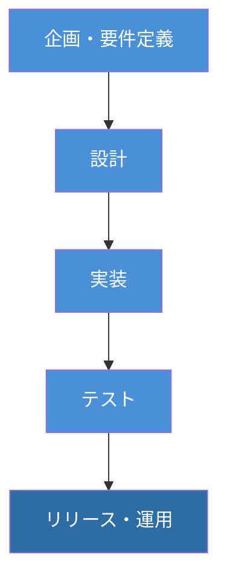
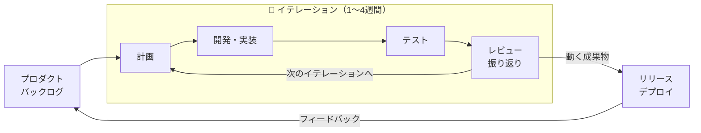
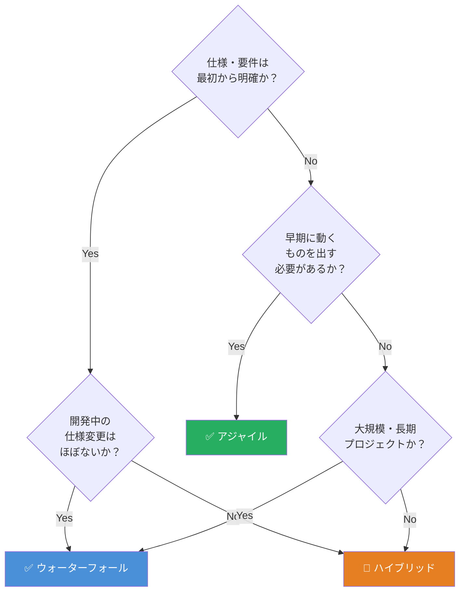

---
tags:
  - knowledge
  - 調査
  - 開発手法
  - アジャイル
  - ウォーターフォール
  - プロジェクト管理
created: 2026-04-07
---

## 概要

ウォーターフォールとアジャイルは、ソフトウェア開発における代表的な2つの手法。前者は工程を順番に進める計画重視型、後者は短い反復サイクルを繰り返す柔軟性重視型。それぞれに明確なメリット・デメリットがあり、プロジェクトの性質に応じた使い分けが重要。

## 結論

- 仕様が固まっており変更が少ない大規模プロジェクト → **ウォーターフォール**が適切
- 要件が流動的でフィードバックを取り込みながら進めたいプロジェクト → **アジャイル**が適切
- どちらが「優れている」ではなく、プロジェクトの性質・規模・チーム体制によって使い分けることが重要
- 近年は両者を組み合わせた「ハイブリッド開発」も現実的な選択肢として注目されている

## 要点

| 観点 | ウォーターフォール | アジャイル |
|------|-----------------|-----------|
| 進め方 | 工程を順番に一方向へ進める | 短いサイクル（イテレーション）を繰り返す |
| 仕様変更 | 対応困難・コスト増大 | 柔軟に対応可能 |
| リリース | 全工程完了後に一括リリース | 優先度の高い機能から段階リリース可能 |
| 進捗管理 | しやすい（工程が明確） | 難しい（変動が多い） |
| 向いているプロジェクト | 大規模・仕様確定・品質重視 | 小〜中規模・要件流動・スピード重視 |

## 詳細

### ウォーターフォール開発

「企画 → 設計 → 実装 → テスト → 運用」という工程を順番にこなし、前工程が完了するまで次に進まない手法。水が上から下に流れるイメージが名称の由来。

#### メリット

- **進捗・予算管理がしやすい**：各工程に明確な完了基準があり、スケジュール・コストの見積もりが立てやすい
- **品質の担保**：全工程を計画通りに進めるため、品質基準を守りやすい。大規模システムや品質重視の案件に向いている
- **ドキュメントが整備されやすい**：各工程で成果物の納品基準が明確なため、仕様書・設計書が体系的にそろいやすい
- **人員配置の計画が立てやすい**：工程ごとにリソースを配分でき、大人数のチームでも役割が明確になる

#### デメリット

- **仕様変更への対応が困難**：開発途中の変更は前工程への手戻りを伴い、コスト・工数が大幅に増加する
- **開発期間が長期化しやすい**：前工程が終わるまで次に進めないため、全体のリードタイムが長くなる傾向がある
- **完成まで動くものが確認できない**：全工程完了後に一括リリースが基本のため、顧客が実物を確認できるのが遅い
- **要件定義の精度に大きく依存**：初期段階の仕様漏れが後工程で大きな問題になるリスクがある

---

### アジャイル開発

1〜4週間程度の短い反復期間（イテレーション/スプリント）を繰り返しながら、機能単位で開発・検証・改善を進める手法。2001年の「アジャイルソフトウェア開発宣言」を思想的背景に持つ。

#### メリット

- **仕様変更への柔軟な対応**：各イテレーション終了時に見直しができるため、市場変化や顧客フィードバックを取り込みやすい
- **早期リリース・早期価値提供**：優先度の高い機能から順にリリースでき、最短1〜2週間で動くものを届けられる
- **顧客ニーズの反映**：開発側と顧客が継続的に協議しながら進めるため、ニーズとのズレを早期に検出できる
- **リスクの早期発見**：小さなサイクルで繰り返すため、問題が小さいうちに表面化しやすい

#### デメリット

- **最終形のブレが生じやすい**：仕様を都度変更するため、当初のコンセプトと完成物が乖離するリスクがある
- **進捗管理・コスト見積もりが難しい**：変更が多く全体像が見えにくいため、スケジュールや予算のコントロールが難しい
- **高度なプロジェクト管理スキルが必要**：頻繁な仕様変更を管理し続けるには、マネジメント経験のある人材が必要
- **経験者が少ない**：比較的新しい手法のため、実務経験者が少なく人材確保が難しい場合がある
- **大規模・長期プロジェクトには不向き**：全体を計画的に進めることが難しく、大規模投資を伴うプロジェクトには合わないケースがある

## 実務でどう使うか

プロジェクト開始時の判断フロー：

- **ウォーターフォールが向いているケース**
  - 基幹システムや金融・インフラ系など、仕様が固定されており変更リスクが低い案件
  - 納期・品質が厳格に求められるプロジェクト
  - 社内の意思決定が遅く、頻繁なレビューが難しい体制
- **アジャイルが向いているケース**
  - WebサービスやスマホアプリなどUX改善を繰り返す製品開発
  - 要件が曖昧な段階からスタートし、顧客フィードバックで方向を決めていく案件
  - スピードを優先し、早期に市場検証したいプロダクト
- **ハイブリッド（折衷）アプローチ**
  - 基本設計まではウォーターフォールで仕様を固め、実装・テストはアジャイルで柔軟に進める方法も現実的な選択肢

## 参考リンク
- [[今更聞けないアジャイル開発とウォーターフォール開発の違い｜SKY Tech Blog（スカイ テック ブログ）]]
- [[「アジャイル vs ウォーターフォール」からプロジェクト管理を考える]]
- [[ウォーターフォールとアジャイルの違いを比較しながら解説！使い分け比較表]]

## 関連ノート
- [[ ]]
